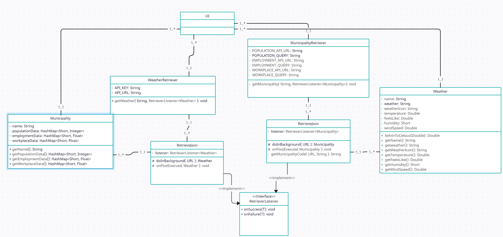

# General description
This is an Android application which allows the user to obtain information
about a specific city, and its weather. It also contains a quiz.

# List of features
* Images - 2 points
* More than 1 data source - 3 points
* Quiz - 4 points
* Fragments - 4 points
* Data visualization - 5 points
* Feature X (detailed and brief info) - 2 points

# Division of labor
* UI - Vadim Onosovskii
* API - Rareș Radu
* Quiz Logic - Vadim Onosovskii
* Data visualization - Rareș Radu

# Installation instructions
The application does not need any special installation instructions.
It is installed as you would any other application. 
The application uses my API key, so there is no need to use any.

# Class Diagram
